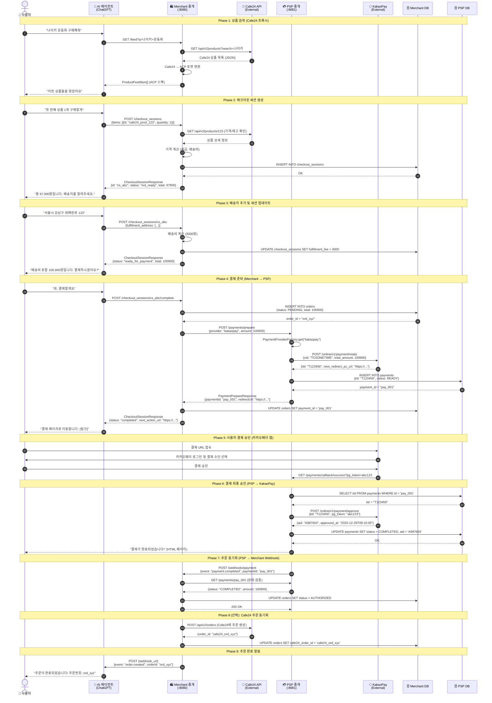

# 🏗️ 시스템 아키텍처: 중개 서버 기반 설계

> **설계 철학**: Merchant는 Cafe24 API를 프록시하고, PSP는 다중 결제 제공자를 중개하는 **확장 가능한 중개 서버 아키텍처**

---

## 🎯 아키텍처 핵심 변경 사항

### 중개 서버 패턴 (Proxy/Adapter Pattern)

기존 설계에서 Merchant와 PSP가 자체 데이터를 관리하는 것에서, **외부 서비스를 중개하는 Adapter 서버**로 역할 변경:

```
기존 설계: Agent → Merchant(자체 DB) → PSP(자체 DB) → KakaoPay
최종 설계: Agent → Merchant 중개(Cafe24 Proxy) → PSP 중개(Multi-Provider) → KakaoPay/Toss/Stripe
```

### 주요 변경 내용

1. **Merchant 서버**: Cafe24 Open API를 ACP 스펙으로 변환하는 **프록시 서버**
   - Cafe24의 실제 상품 데이터를 가져와 ACP Product Feed로 변환
   - 결제 관련 엔드포인트만 자체 구현
   - 최소한의 상태 관리 (checkout_sessions, orders)

2. **PSP 서버**: 다중 PSP를 지원하는 **Adapter 서버** (Strategy Pattern)
   - KakaoPay, Toss, Stripe 등 다양한 PSP 지원
   - 런타임에 PSP 선택 가능
   - 통합된 인터페이스로 일관된 결제 경험 제공

---

## 📐 시스템 개요

### 아키텍처 원칙

1. **중개 서버 패턴 (Proxy/Adapter)**
   - Merchant: 외부 커머스 플랫폼(Cafe24) 프록시
   - PSP: 다중 결제 제공자 어댑터
   - 확장 가능: Shopify, WooCommerce 등 추가 가능

2. **물리적 분리 (Physical Separation)**
   - Merchant와 PSP를 독립된 프로세스로 실행
   - 실제 네트워크 통신 시뮬레이션 (HTTP/REST)
   - 각 서버는 독립적인 데이터베이스 스키마 소유

3. **헥사고날 아키텍처 (Ports & Adapters)**
   - **도메인 계층**: 순수 Kotlin, 외부 의존성 없음
   - **포트 계층**: 인터페이스 정의 (Input Port, Output Port)
   - **어댑터 계층**: 외부 시스템 연동 (REST, DB, 외부 API)

4. **도메인 주도 설계 (DDD)**
   - **Bounded Context**: Merchant, PSP 각각 독립된 컨텍스트
   - **Aggregate**: Order, Payment 등 일관성 경계 정의
   - **Value Object**: Money, Address 등 불변 객체

5. **비동기 Non-Blocking**
   - Kotlin Coroutines + Suspending Functions
   - Virtual Threads (JDK 21) 활용
   - Blocking I/O는 `Dispatchers.IO`로 격리

---

## 🗺️ 컴포넌트 다이어그램

```
┌─────────────────────────────────────────────────────────────────┐
│                    AI Agent / ChatGPT                            │
│                  (External, OpenAI 운영)                         │
└────────────────────────────┬────────────────────────────────────┘
                             │ HTTPS (ACP Protocol)
                             ▼
┌─────────────────────────────────────────────────────────────────┐
│              Merchant 중개 서버 (:8080)                          │
│              "ACP ↔ Cafe24 변환 레이어"                         │
├─────────────────────────────────────────────────────────────────┤
│  ┌──────────────────────────────────────────────────────────┐  │
│  │         ACP Adapter (Inbound)                             │  │
│  │  - FeedController: GET /feed                              │  │
│  │  - CheckoutController: POST /checkout_sessions            │  │
│  │  - OrderController: 주문 생성/조회                        │  │
│  └────────────────────┬─────────────────────────────────────┘  │
│                       ▼                                          │
│  ┌──────────────────────────────────────────────────────────┐  │
│  │         Application Layer                                 │  │
│  │  - ProductFeedUseCase (Cafe24 → ACP 변환)                │  │
│  │  - CheckoutUseCase (세션 관리, 가격 계산)                │  │
│  │  - OrderUseCase (주문 생성, PSP 호출)                    │  │
│  └────────────────────┬─────────────────────────────────────┘  │
│                       ▼                                          │
│  ┌──────────────────────────────────────────────────────────┐  │
│  │         Domain Layer                                      │  │
│  │  - CheckoutSession (Aggregate)                            │  │
│  │  - Order (Entity)                                         │  │
│  │  - Money, Address (Value Objects)                         │  │
│  └────────────────────┬─────────────────────────────────────┘  │
│                       ▼                                          │
│  ┌──────────────────────────────────────────────────────────┐  │
│  │         Adapter Layer (Outbound)                          │  │
│  │  - Cafe24ProductAdapter: 상품 조회                       │  │
│  │  - Cafe24OrderAdapter: 주문 생성 (선택)                  │  │
│  │  - PspClientAdapter: PSP 서버 호출                        │  │
│  │  - CheckoutSessionRepository (jOOQ)                       │  │
│  │  - RedisCache (상품 피드 캐싱)                           │  │
│  └──────────────────────────────────────────────────────────┘  │
└────────┬────────────────────────────┬────────────────────────────┘
         │ HTTPS                      │ HTTP (Internal)
         ▼                            ▼
┌──────────────────────┐    ┌─────────────────────────────────────┐
│   Cafe24 API         │    │   PSP 중개 서버 (:8081)             │
│   (External)         │    │   "Multi-PSP Adapter"               │
│                      │    ├─────────────────────────────────────┤
│ - 상품 조회          │    │  ┌────────────────────────────────┐ │
│ - 카테고리 조회      │    │  │  Payment Controller            │ │
│ - 재고 확인          │    │  │  - POST /payments/prepare      │ │
│ - 주문 생성 (선택)   │    │  │  - GET /payments/{id}          │ │
└──────────────────────┘    │  │  - POST /payments/cancel       │ │
                            │  └──────────┬─────────────────────┘ │
                            │             ▼                        │
                            │  ┌────────────────────────────────┐ │
                            │  │  Application Layer             │ │
                            │  │  - PreparePaymentUseCase       │ │
                            │  │  - ApprovePaymentUseCase       │ │
                            │  │  - CancelPaymentUseCase        │ │
                            │  └──────────┬─────────────────────┘ │
                            │             ▼                        │
                            │  ┌────────────────────────────────┐ │
                            │  │  Domain Layer                  │ │
                            │  │  - Payment (Aggregate)         │ │
                            │  │  - PaymentStatus (State)       │ │
                            │  └──────────┬─────────────────────┘ │
                            │             ▼                        │
                            │  ┌────────────────────────────────┐ │
                            │  │  PSP Strategy Pattern          │ │
                            │  │  - PaymentProviderFactory      │ │
                            │  │  - KakaoPayProvider            │ │
                            │  │  - TossProvider (Future)       │ │
                            │  │  - StripeProvider (Future)     │ │
                            │  └──────────┬─────────────────────┘ │
                            │             ▼                        │
                            │  ┌────────────────────────────────┐ │
                            │  │  Adapter Layer (Outbound)      │ │
                            │  │  - PaymentRepository (jOOQ)    │ │
                            │  │  - KakaoPayClientAdapter       │ │
                            │  │  - TossClientAdapter (Future)  │ │
                            │  │  - EncryptionService           │ │
                            │  └────────────────────────────────┘ │
                            └──────────┬──────────────────────────┘
                                       │ HTTPS (External)
                                       ▼
                            ┌──────────────────────────────────────┐
                            │  실제 PSP APIs                       │
                            ├──────────────────────────────────────┤
                            │  - KakaoPay API (현재)              │
                            │  - Toss Payments API (예정)         │
                            │  - Stripe API (예정)                │
                            └──────────────────────────────────────┘

---

## 📁 디렉토리 및 파일 구조 (헥사고날 아키텍처)

모든 서버 모듈(`acp-merchant`, `acp-psp`)은 다음의 헥사고날 아키텍처 표준 구조를 따릅니다:

### 1. `adapter` (외부 연결망)
외부 시스템과의 통신을 담당하며, 도메인/애플리케이션 계층에 의존합니다.
- **inbound**: 애플리케이션을 호출하는 어댑터
  - `web`: REST API Controller, WebFlux Handler
- **outbound**: 외부 시스템을 호출하는 어댑터
  - `cafe24`: Cafe24 API 클라이언트 실구현
  - `persistence`: jOOQ 기반 DB 연동 (Repository 구현체)
  - `external`: 외부 API 클라이언트 (KakaoPay 등)

### 2. `application` (비즈니스 오케스트레이션)
핵심 비즈니스 로직의 흐름을 제어하며, 도메인 모델을 사용합니다.
- **port**: 외부와 소통하기 위한 인터페이스 정의
  - `input`: UseCase 인터페이스 (Controller가 호출)
  - `output`: 외부 시스템 호출을 위한 포트 (Persistence, API Client)
- **service**: UseCase 구현 클래스 (비즈니스 로직 수행)

### 3. `domain` (비즈니스 핵심)
외부 라이브러리 의존성이 없는 순수 핵심 로직입니다.
- **model**: 엔티티(Entity), 값 객체(Value Object), 집합체(Aggregate)
- **service**: 도메인 간의 로직이나 변환 로직 (예: Cafe24ToAcpConverter)

---

## 🔄 E2E 결제 플로우 (상세 시퀀스 다이어그램)

### 전체 플로우 개요



---

## 🏛️ 모듈 구조 및 책임

### 프로젝트 디렉토리 구조

```
acp/
├── acp-merchant/              # Merchant 서버 (Port 8080)
│   ├── src/main/kotlin/com/acp/merchant/
│   │   ├── adapter/
│   │   │   ├── inbound/       # REST Controllers
│   │   │   │   ├── FeedController.kt
│   │   │   │   ├── CheckoutController.kt
│   │   │   │   └── WebhookController.kt
│   │   │   └── outbound/      # External Integrations
│   │   │       ├── OrderRepositoryAdapter.kt
│   │   │       ├── ProductRepositoryAdapter.kt
│   │   │       ├── PspClientAdapter.kt
│   │   │       └── RedisCacheAdapter.kt
│   │   ├── application/       # Use Cases (Application Services)
│   │   │   ├── usecase/
│   │   │   │   ├── CreateCheckoutSessionUseCase.kt
│   │   │   │   ├── UpdateCheckoutSessionUseCase.kt
│   │   │   │   ├── CompleteCheckoutUseCase.kt
│   │   │   │   └── GetProductFeedUseCase.kt
│   │   │   └── port/
│   │   │       ├── input/     # Input Ports (Interfaces)
│   │   │       │   ├── CheckoutService.kt
│   │   │       │   └── ProductService.kt
│   │   │       └── output/    # Output Ports (Interfaces)
│   │   │           ├── OrderRepository.kt
│   │   │           ├── ProductRepository.kt
│   │   │           └── PspClient.kt
│   │   ├── domain/            # 순수 도메인 로직 (Spring 의존성 없음)
│   │   │   ├── model/
│   │   │   │   ├── Order.kt           # Aggregate Root
│   │   │   │   ├── OrderLine.kt       # Entity
│   │   │   │   ├── Product.kt         # Entity
│   │   │   │   ├── Money.kt           # Value Object
│   │   │   │   ├── Address.kt         # Value Object
│   │   │   │   └── OrderStatus.kt     # Enum
│   │   │   └── service/
│   │   │       ├── PricingEngine.kt   # 가격 계산 로직
│   │   │       └── TaxCalculator.kt   # 세금 계산 로직
│   │   └── config/
│   │       ├── WebClientConfig.kt
│   │       ├── RedisConfig.kt
│   │       └── SecurityConfig.kt
│   └── src/main/resources/
│       ├── db/migration/      # Flyway Migrations
│       │   ├── V1__create_products.sql
│       │   ├── V2__create_orders.sql
│       │   └── V3__create_checkout_sessions.sql
│       └── application.yml
│
├── acp-psp/                   # PSP 서버 (Port 8081)
│   ├── src/main/kotlin/com/acp/psp/
│   │   ├── adapter/
│   │   │   ├── inbound/
│   │   │   │   ├── PaymentController.kt
│   │   │   │   └── CallbackController.kt
│   │   │   └── outbound/
│   │   │       ├── PaymentRepositoryAdapter.kt
│   │   │       ├── KakaoPayClientAdapter.kt
│   │   │       └── EncryptionServiceAdapter.kt
│   │   ├── application/
│   │   │   ├── usecase/
│   │   │   │   ├── PreparePaymentUseCase.kt
│   │   │   │   ├── ApprovePaymentUseCase.kt
│   │   │   │   └── CancelPaymentUseCase.kt
│   │   │   └── port/
│   │   │       ├── input/
│   │   │       │   └── PaymentService.kt
│   │   │       └── output/
│   │   │           ├── PaymentRepository.kt
│   │   │           └── KakaoPayClient.kt
│   │   ├── domain/
│   │   │   ├── model/
│   │   │   │   ├── Payment.kt         # Aggregate Root
│   │   │   │   ├── PaymentStatus.kt   # State Machine
│   │   │   │   └── Money.kt           # Value Object
│   │   │   └── service/
│   │   │       └── PaymentStateMachine.kt
│   │   └── config/
│   │       ├── KakaoPayConfig.kt
│   │       └── EncryptionConfig.kt
│   └── src/main/resources/
│       ├── db/migration/
│       │   ├── V1__create_payments.sql
│       │   └── V2__create_payment_partner_meta.sql
│       └── application.yml
│
├── acp-shared/                # 공유 스키마 (Kotlin Multiplatform)
│   └── src/commonMain/kotlin/com/acp/schema/
│       ├── feed/
│       │   └── FeedModels.kt  # ProductFeedItem, Availability
│       ├── checkout/
│       │   └── CheckoutModels.kt  # CheckoutSessionRequest/Response
│       └── payment/
│           └── PaymentModels.kt   # PaymentPrepareRequest/Response
│
├── acp-client/                # 에이전트 시뮬레이터 (Compose Desktop)
│   └── src/jvmMain/kotlin/
│       ├── ui/
│       │   ├── ChatScreen.kt
│       │   └── DebugPanel.kt
│       └── agent/
│           └── AgentSimulator.kt
│
├── docker/
│   └── docker-compose.yml     # PostgreSQL, Redis, Prometheus, Grafana
│
├── docs/
│   ├── TODO.md                # 프로젝트 로드맵
│   ├── ARCHITECTURE.md        # 이 문서
│   ├── DB_SCHEMA.md           # 데이터베이스 스키마
│   └── API_SPEC.md            # API 명세서 (추가 예정)
│
└── build.gradle.kts
```

---

## 🔌 API 계약 (Contracts)

### Merchant 서버 (:8080)

#### 1. Product Feed API

**GET /feed**
- **목적**: OpenAI Product Feed Spec을 준수하는 상품 피드 제공
- **인증**: API Key (Authorization: Bearer)
- **응답 포맷**: JSON, JSON Lines (.jsonl.gz)
- **캐싱**: Redis (TTL 5분), ETag 지원
- **예시**:
  ```json
  [
    {
      "id": "prod_123",
      "title": "나이키 에어맥스 270",
      "description": "편안한 쿠셔닝과 스타일리시한 디자인",
      "link": "https://merchant.example.com/products/prod_123",
      "image_link": "https://cdn.example.com/images/prod_123.jpg",
      "price": "89000",
      "currency": "KRW",
      "availability": "in_stock",
      "brand": "Nike",
      "product_category": "신발 > 운동화"
    }
  ]
  ```

#### 2. Checkout Session API

**POST /checkout_sessions**
- **목적**: 체크아웃 세션 생성
- **멱등성**: Idempotency-Key 헤더 필수
- **요청**:
  ```json
  {
    "items": [{"id": "prod_123", "quantity": 1}],
    "buyer": {"email": "user@example.com", "name": "홍길동"},
    "fulfillment_address": {
      "country_code": "KR",
      "postal_code": "06234"
    }
  }
  ```
- **응답**: `CheckoutSessionResponse` (status: not_ready_for_payment)

**POST /checkout_sessions/{id}**
- **목적**: 세션 업데이트 (수량 변경, 주소 변경 등)

**POST /checkout_sessions/{id}/complete**
- **목적**: 주문 확정 및 결제 준비
- **응답**: `next_action_url` (카카오페이 리다이렉트 URL)

**GET /checkout_sessions/{id}**
- **목적**: 세션 조회

**POST /checkout_sessions/{id}/cancel**
- **목적**: 세션 취소

#### 3. Webhook Receiver

**POST /webhooks/payment**
- **목적**: PSP로부터 결제 상태 변경 알림 수신
- **서명 검증**: HMAC-SHA256

---

### PSP 서버 (:8081)

#### 1. Payment Preparation

**POST /api/v1/payments/prepare**
- **목적**: 카카오페이 결제 준비
- **멱등성**: `merchant_order_id`로 중복 방지
- **요청**:
  ```json
  {
    "merchantOrderId": "ord_xyz",
    "amount": 100900,
    "currency": "KRW",
    "items": [
      {"name": "나이키 에어맥스 270", "quantity": 1, "unitPrice": 89000}
    ]
  }
  ```
- **응답**:
  ```json
  {
    "paymentId": "pay_001",
    "merchantOrderId": "ord_xyz",
    "redirectUrl": "https://online-pay.kakao.com/mockup/...",
    "status": "READY"
  }
  ```

#### 2. Payment Status

**GET /api/v1/payments/{id}**
- **목적**: 결제 상태 조회
- **응답**:
  ```json
  {
    "id": "pay_001",
    "status": "COMPLETED",
    "amount": 100900,
    "approvedAt": "2025-12-29T09:15:00Z"
  }
  ```

#### 3. Callbacks (카카오페이 리다이렉트)

**GET /api/v1/payments/callback/success?pg_token={token}**
- **목적**: 결제 승인 처리
- **플로우**: pg_token 추출 → 카카오페이 승인 API 호출 → DB 업데이트 → 성공 페이지 표시

**GET /api/v1/payments/callback/cancel**
- **목적**: 사용자 결제 취소

**GET /api/v1/payments/callback/fail**
- **목적**: 결제 실패 처리

---

## 🔐 보안 아키텍처

### 1. 인증 및 인가

```
┌─────────────┐
│  AI Agent   │
└──────┬──────┘
       │ Authorization: Bearer {api_key}
       ▼
┌─────────────────────────────────┐
│  API Gateway (Future)           │
│  - Rate Limiting                │
│  - API Key Validation           │
│  - Request Signing Verification │
└──────┬──────────────────────────┘
       │
       ▼
┌─────────────────────────────────┐
│  Merchant Server                │
│  - SecurityFilter               │
│  - HMAC-SHA256 Signature Check  │
└─────────────────────────────────┘
```

### 2. 데이터 암호화

- **전송 중 (In-Transit)**: TLS 1.3, HSTS
- **저장 시 (At-Rest)**: 
  - 민감 필드 (pg_token, tid): AES-256-GCM
  - 암호화 키: AWS KMS 또는 HashiCorp Vault
  - 키 로테이션: 90일마다

### 3. 민감 정보 마스킹

```kotlin
// 로그 출력 시 자동 마스킹
logger.info("Payment approved for user ${user.email.mask()}")
// 출력: "Payment approved for user u***@example.com"
```

---

## 📊 관측성 아키텍처

### 메트릭 수집 플로우

```
┌─────────────┐    ┌─────────────┐
│  Merchant   │    │     PSP     │
│   Server    │    │   Server    │
└──────┬──────┘    └──────┬──────┘
       │ /actuator/       │ /actuator/
       │ prometheus        │ prometheus
       ▼                   ▼
┌─────────────────────────────────┐
│       Prometheus Server         │
│   - Scrape Interval: 15s        │
│   - Retention: 30 days          │
└──────┬──────────────────────────┘
       │
       ▼
┌─────────────────────────────────┐
│         Grafana                 │
│   - Business Dashboard          │
│   - System Dashboard            │
│   - Error Dashboard             │
└─────────────────────────────────┘
```

### 분산 트레이싱

```
Agent Request (trace_id: abc123)
  └─> Merchant: GET /feed (span_id: 001)
      └─> DB Query (span_id: 002)
  └─> Merchant: POST /checkout_sessions (span_id: 003)
      └─> PSP: POST /payments/prepare (span_id: 004)
          └─> KakaoPay: POST /ready (span_id: 005)
```

---

## 🚀 배포 아키텍처 (Future)

### Kubernetes 배포

```yaml
# 예시: Merchant Deployment
apiVersion: apps/v1
kind: Deployment
metadata:
  name: acp-merchant
spec:
  replicas: 3
  template:
    spec:
      containers:
      - name: merchant
        image: acp-merchant:latest
        env:
        - name: SPRING_PROFILES_ACTIVE
          value: "production"
        - name: DB_URL
          valueFrom:
            secretKeyRef:
              name: db-credentials
              key: url
        resources:
          requests:
            memory: "512Mi"
            cpu: "500m"
          limits:
            memory: "1Gi"
            cpu: "1000m"
        livenessProbe:
          httpGet:
            path: /actuator/health/liveness
            port: 8080
        readinessProbe:
          httpGet:
            path: /actuator/health/readiness
            port: 8080
```

---

## 🔄 상태 머신

### 주문 상태 (Order Status)

```
     ┌─────────┐
     │ PENDING │ ◄─── 체크아웃 세션 완료 시
     └────┬────┘
          │
          │ 결제 승인 완료
          ▼
    ┌──────────┐
    │AUTHORIZED│
    └────┬─────┘
         │
         │ 상품 발송
         ▼
    ┌──────────┐
    │COMPLETED │
    └──────────┘

    ┌──────────┐
    │ CANCELED │ ◄─── 사용자 취소 또는 타임아웃
    └──────────┘

    ┌──────────┐
    │  FAILED  │ ◄─── 결제 실패 또는 재고 부족
    └──────────┘
```

### 결제 상태 (Payment Status)

```
    ┌───────┐
    │ READY │ ◄─── 카카오페이 tid 발급
    └───┬───┘
        │
        │ 사용자가 결제 URL 접속
        ▼
  ┌─────────────┐
  │ IN_PROGRESS │
  └──────┬──────┘
         │
         │ pg_token으로 승인 완료
         ▼
    ┌──────────┐
    │COMPLETED │
    └──────────┘

    ┌──────────┐
    │  FAILED  │ ◄─── 카드 한도 초과, 네트워크 오류
    └──────────┘

    ┌──────────┐
    │ CANCELED │ ◄─── 사용자 취소 또는 환불
    └──────────┘
```

---

## 🎯 설계 결정 기록 (ADR)

### ADR-001: jOOQ 선택 이유

**상황**: ORM(JPA) vs Type-Safe SQL(jOOQ) 선택 필요

**결정**: jOOQ 사용

**이유**:
1. **명시적 제어**: 복잡한 조인 및 집계 쿼리를 명시적으로 작성
2. **컴파일 타임 검증**: SQL 오류를 런타임이 아닌 컴파일 시점에 발견
3. **성능**: N+1 문제 없음, 필요한 컬럼만 SELECT
4. **Virtual Threads 호환**: Blocking JDBC를 `Dispatchers.IO`로 격리하여 Non-Blocking 유지

**트레이드오프**: 초기 설정 복잡도 증가 (CodeGen 필요)

---

### ADR-002: 2-Server 아키텍처

**상황**: Monolith vs Microservices

**결정**: 2-Server (Merchant + PSP) 물리적 분리

**이유**:
1. **실제 환경 시뮬레이션**: 실제 커머스 생태계에서는 Merchant와 PSP가 독립적
2. **보안**: 결제 정보를 PSP에서만 관리, Merchant는 접근 불가
3. **확장성**: 각 서버를 독립적으로 스케일링 가능
4. **개발 편의성**: Monolith보다 단순, Full Microservices보다 복잡도 낮음

---

### ADR-003: Kotlin Coroutines + Virtual Threads

**상황**: Reactive (Mono/Flux) vs Coroutines

**결정**: Kotlin Coroutines + Virtual Threads

**이유**:
1. **가독성**: Suspending Functions가 Reactive 체인보다 직관적
2. **디버깅**: 스택 트레이스가 명확
3. **Virtual Threads**: JDK 21의 Virtual Threads로 높은 동시성 확보
4. **Blocking I/O 호환**: JDBC, Redis 등 Blocking 라이브러리를 `Dispatchers.IO`로 격리

---

## 📚 참고 자료

- [Hexagonal Architecture (Alistair Cockburn)](https://alistair.cockburn.us/hexagonal-architecture/)
- [Domain-Driven Design (Eric Evans)](https://www.domainlanguage.com/ddd/)
- [OpenAI Agentic Commerce Protocol](https://developers.openai.com/commerce/guides/get-started)
- [카카오페이 개발자센터](https://developers.kakaopay.com/)
- [Spring Boot 3.5.3 Reference](https://docs.spring.io/spring-boot/docs/3.5.3/reference/html/)
- [jOOQ Manual](https://www.jooq.org/doc/latest/manual/)
- [Kotlin Coroutines Guide](https://kotlinlang.org/docs/coroutines-guide.html)