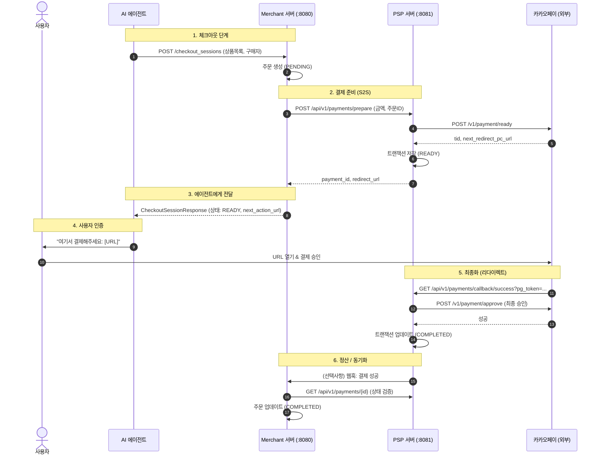

# 🏗️ 아키텍처: 이중 서버 시스템 (Merchant & PSP)

Agentic Commerce 생태계를 완벽하게 시뮬레이션하기 위해 시스템을 두 개의 독립된 서버로 분리했습니다.

## 🗺️ 시스템 개요

| 컴포넌트 | 포트 | 역할 | 데이터베이스 스키마 |
| :--- | :--- | :--- | :--- |
| **Merchant 서버** | `8080` | 상품 피드, 주문 관리 | `merchant` (orders, products) |
| **PSP 서버** | `8081` | 결제 게이트웨이 래퍼 (카카오페이) | `psp` (payments, transactions) |
| **에이전트 시뮬레이터** | CLI | OpenAI 에이전트 시뮬레이션 | N/A |

---

## 🔄 결제 흐름 (시퀀스 다이어그램)

이 다이어그램은 에이전트가 카카오페이를 통한 "위임 결제(Delegated Payment)" 흐름을 사용하여 상품을 구매하는 과정을 보여줍니다.



---

## 🏛️ 모듈 구조

```text
acp/
├── acp-merchant/       # [Server] Merchant 로직 (Spring Boot)
│   └── src/main/resources/db/migration # Merchant DB 스키마
├── acp-psp/            # [Server] PSP 로직 (Spring Boot)
│   └── src/main/resources/db/migration # PSP DB 스키마
├── acp-shared/         # [Common] 모두가 공유하는 DTO
└── acp-client/         # [Client] 에이전트 시뮬레이터
```

## 🔌 API 계약 (Contracts)

### Merchant 서버 (:8080)
*   `GET /feed`: 상품 피드 (OpenAI 사양)
*   `POST /checkout_sessions`: 주문 생성

### PSP 서버 (:8081)
*   `POST /api/v1/payments/prepare`: 결제 URL 요청
*   `GET /api/v1/payments/{id}`: 결제 상태 확인
*   `GET /api/v1/payments/callback/success`: 카카오페이 리다이렉트 처리