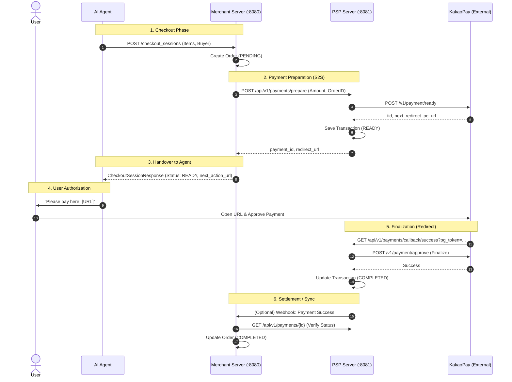

# 🏗️ Architecture: Dual-Server System (Merchant & PSP)

To fully simulate the Agentic Commerce ecosystem, we separate the system into two distinct servers.

## 🗺️ System Overview

| Component | Port | Role | Database Schema |
| :--- | :--- | :--- | :--- |
| **Merchant Server** | `8080` | Product Feed, Order Management | `merchant_db` (orders, products) |
| **PSP Server** | `8081` | Payment Gateway Wrapper (KakaoPay) | `psp_db` (payments, transactions) |
| **Agent Simulator** | CLI | Simulates OpenAI Agent | N/A |

---

## 🔄 The Payment Flow (Sequence Diagram)

This diagram illustrates how an Agent buys a product using the "Delegated Payment" flow via KakaoPay.



---

## 🏛️ Module Structure

```text
acp/
├── acp-merchant/       # [Server] Merchant Logic (Spring Boot)
│   └── src/main/resources/db/migration # Merchant DB Schema
├── acp-psp/            # [Server] PSP Logic (Spring Boot)
│   └── src/main/resources/db/migration # PSP DB Schema
├── acp-shared/         # [Common] DTOs shared by everyone
└── acp-client/         # [Client] Agent Simulator
```

## 🔌 API Contracts

### Merchant Server (:8080)
*   `GET /feed`: Product Feed (OpenAI Spec)
*   `POST /checkout_sessions`: Create Order

### PSP Server (:8081)
*   `POST /api/v1/payments/prepare`: Request Payment URL
*   `GET /api/v1/payments/{id}`: Check Payment Status
*   `GET /api/v1/payments/callback/success`: Handle KakaoPay Redirect
